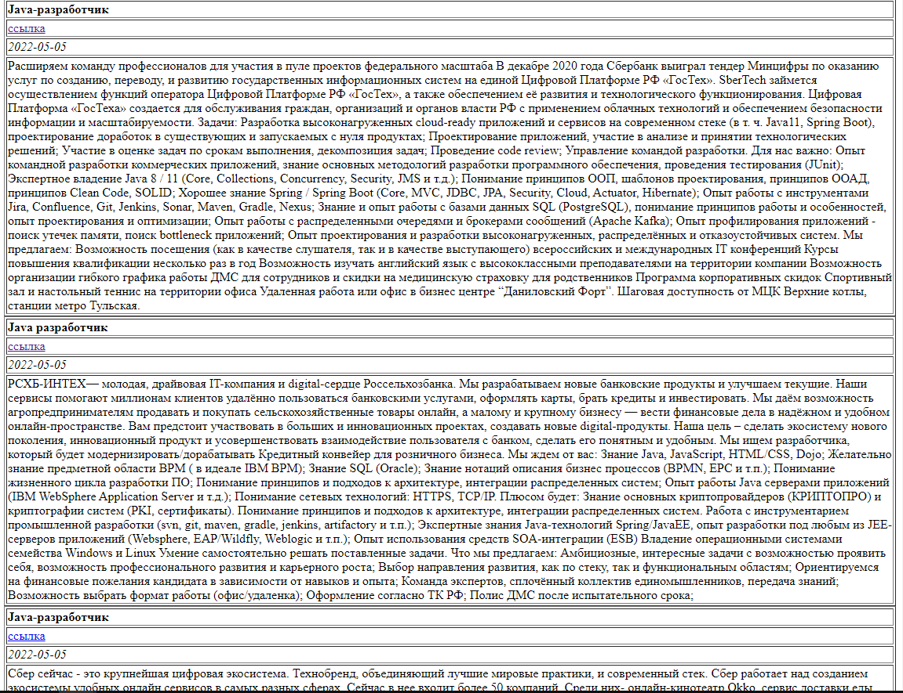

### Проект "Агрегатор вакансий"

## О проекте
#### Описание
Приложение позволяет осуществлять периодический парсинг сайта *career.habr.com*. В нем есть раздел [Вакансии/Java](https://career.habr.com/vacancies/java_developer),
сохранять данные о вакансиях в PostgreSQL-базу и выводить их в HTML-формате пользователю.
Система запускается по расписанию.

#### Технологии
>JDK11, Maven, PostgreSQL, JDBC, Quartz, JSOUP

Доступ к интерфейсу через *REST API*.

## Сборка
0. Скачайте исходники
1. Создайте базу данных в соответствии с настройками, указанными в файле *src/main/resources/rabbit.properties*.
   Также в этом файле задается расписание работы скрипта
2. Осуществите сборку приложения: `mvn clean install`
3. Запустите из консоли командой: `java -jar target/job4j_grabber-1.0.jar`

## Как использовать
После запуска скрипта и успешного парсинга, данные поступят в базу данных. Результаты работы можно увидеть по адресу:
`http://localhost:9000`

Расширение.

- В проект можно добавить новые сайты без изменения кода.

- В проекте можно сделать параллельный парсинг сайтов.

### Контакты:
[][telegram]
[][gmail]
[][linkedin]

[telegram]: https://t.me/GrokDen
[gmail]: mailto:den.voiten@gmail.com
[linkedin]: https://www.linkedin.com/in/denis-voytenko-585488117/
